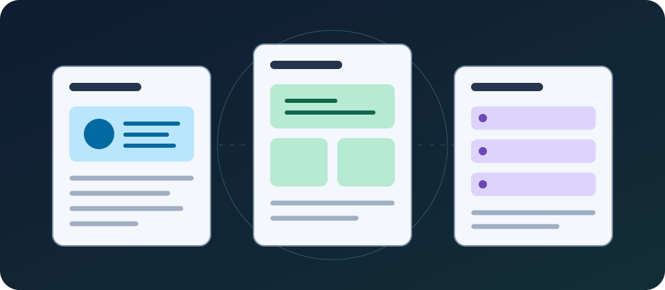
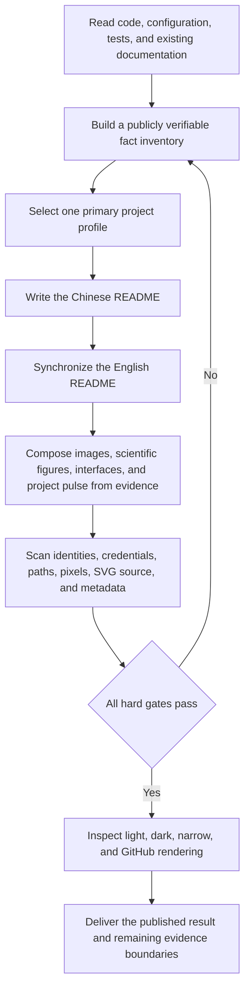

<div align="center">


<h1>GitHub README Standardizer</h1>

<p><strong>Build evidence-backed, actionable, and auditable bilingual repository landing pages</strong></p>

<p>Project maintainers · Documentation owners · Security reviewers</p>

<p>
  
  <a href="README.md"></a>
  <a href="SECURITY.md"></a>
  
</p>

<p>
  <a href="#1-project-value">Project value</a> ·
  <a href="#3-standardization-flow">Standardization flow</a> ·
  <a href="#4-quick-start">Quick start</a> ·
  <a href="#5-project-routing">Project routing</a> ·
  <a href="#7-privacy-and-publication-boundaries">Privacy gate</a> ·
  <a href="#8-validation-status">Validation</a>
</p>

<p><a href="README.md">简体中文</a> · <a href="README.en.md">English</a></p>

</div>

<div align="center">



Figure 1.1. Evidence-backed publication flow

</div>

All numerical values in this document come from repository files and the current auditor output. HTML and SVG dimensions come from layout attributes in their respective files

## 1. Project value

GitHub README Standardizer is a Codex skill for repository landing pages. A skill is a reusable set of execution rules and supporting resources that applies the same evidence, privacy, and quality gates across different tasks

The skill reads code, configuration, tests, documentation, and trustworthy visual assets before producing a Chinese-first README with an English mirror. Deterministic scans and the rendered GitHub result then determine whether publication is safe

<div align="center">

<table>
  <tr>
    <td width="33%" valign="top"><strong>Audit an existing README</strong><br><br>Locate evidence gaps, broken links, missing visuals, and privacy risks</td>
    <td width="33%" valign="top"><strong>Build a bilingual landing page</strong><br><br>Select a structure from the primary deliverable and synchronize commands, status, and limitations</td>
    <td width="33%" valign="top"><strong>Validate publication</strong><br><br>Scan text and assets, inspect the rendered GitHub page, and decide whether to publish</td>
  </tr>
</table>

Table 1.1. Entry points

</div>

## 2. Core capabilities

<div align="center">

| Capability | Observable result | Evidence |
|---|---|---|
| Project-profile routing | Applications, APIs, command-line tools, infrastructure, AI/data, and technical content receive different landing-page structures | [`references/profile-routing.md`](references/profile-routing.md) |
| Bilingual fact synchronization | `README.md` uses Simplified Chinese while `README.en.md` mirrors commands, status, diagrams, and limitations | [`references/content-protocol.md`](references/content-protocol.md) |
| Modular composition | Core modules remain complete while interface, scientific, and dynamic modules are enabled only by evidence | [`references/module-catalog.md`](references/module-catalog.md) |
| Image production | Runtime evidence, explanatory graphics, and brand visuals receive separate generation, format, theme, and fallback rules | [`references/visual-production.md`](references/visual-production.md) |
| Scientific visualization | Figure choice, axes, units, samples, uncertainty, data provenance, and reproduction entry points are specified | [`references/scientific-visualization.md`](references/scientific-visualization.md) |
| UI and UX evidence | Synthetic interfaces cover a complete task and are checked in light, dark, narrow, and failure states | [`references/ui-ux-evidence.md`](references/ui-ux-evidence.md) |
| Badges and project pulse | Trust status stays above the fold; stars, downloads, and trends appear only at the end | [`references/metrics-and-badges.md`](references/metrics-and-badges.md) |
| Visual privacy | Pixels, SVG source, file metadata, and remote visual requests are reviewed together | [`references/visual-privacy.md`](references/visual-privacy.md) |
| Deterministic audit | Mermaid turns text relationships into a rendered flowchart; the auditor checks its direction and blocks publication when that direction is invalid | [`scripts/audit_readme.py`](scripts/audit_readme.py) |
| Rendered validation | The GitHub page must preserve images, tables, links, details blocks, and Mermaid markup | [`references/validation.md`](references/validation.md) |

Table 2.1. Core capabilities and observable results

</div>

## 3. Standardization flow

The following flow shows how repository evidence enters the README and how the privacy gate blocks an untrustworthy publication

<div align="center">



Figure 3.1. Execution path from repository evidence to a trustworthy README

</div>

## 4. Quick start

Complete these prerequisites before running the quick start:

- Configure a Codex skill directory
- Install Python 3.10 or later; the requirement comes from the union type syntax used by the audit program

- Step 1, install the skill from the checked-out repository root

  ```powershell
  $SkillSource = (Get-Location).Path # Read the reviewed skill files from the current repository root
  $SkillTarget = Join-Path $env:CODEX_HOME "skills/github-readme-standardizer" # Build the destination under the configured Codex directory
  New-Item -ItemType Directory -Path $SkillTarget -Force | Out-Null # Ensure the destination exists before copying files
  Copy-Item -Path (Join-Path $SkillSource "*") -Destination $SkillTarget -Recurse -Force # Copy instructions, references, templates, and the auditor
  ```

- Step 2, run a full audit against a target repository

  ```powershell
  python scripts/audit_readme.py "<repository-path>" --scan-repository --strict-warnings # Replace the semantic placeholder and scan README files, source, fixtures, and visuals; unresolved warnings block formal publication
  ```

- Step 3, inspect the JSON result

  Items in `errors` block publication. Items in `warnings` require human review; formal publication uses `--strict-warnings`. The auditor never modifies the target repository

Expected result: the auditor returns `PASS` or `FAIL` with specific issue codes, and it does not echo complete secret values that it detects

## 5. Project routing

The skill selects one primary profile from the main deliverable. Mixed repositories can add a small number of conditional modules without combining several complete templates into one landing page

<div align="center">

| Profile | Primary deliverable | First visual evidence | First success |
|---|---|---|---|
| User application | Web, desktop, or mobile application | Sanitized interface screenshot | Complete one safe user flow |
| Developer interface | Library, SDK, or API component | Minimal call and output | Complete one observable call |
| Command-line tool | Terminal tool or local automation | Synthetic terminal demonstration | Run one safe command |
| Infrastructure service | Long-running service or control plane | Architecture and trust boundary | Start an isolated service and check health |
| AI and data | Model, dataset, training, or evaluation project | Task scope or evaluation relationship | Run a minimal example with synthetic input |
| Technical content | Book, course, knowledge base, or specification | Content map | Open the reading entry point or build a preview |

Table 5.1. Primary project profiles

</div>

## 6. Repository structure

<div align="center">

| Path | Content | When to read or run it |
|---|---|---|
| `SKILL.md` | Goals, authorization boundaries, primary flow, and hard gates | Every skill invocation |
| `agents/openai.yaml` | Codex display name, icon, and default prompt | Skill discovery or invocation |
| `assets/README.*.template.md` | Complete Chinese-first and English-mirror skeletons | Creating or restructuring a README |
| `assets/visual-modules.*.md` | Bilingual snippets for images, scientific figures, interfaces, stability, privacy, and project pulse | Enabling a conditional visual module |
| `references/module-catalog.md` | Module order, evidence requirements, and deletion rules | Composing the README structure |
| `references/visual-*.md` | Image production and visual privacy details | Any visual asset is in scope |
| `references/scientific-visualization.md` | Semantics and reproducibility for scientific and performance figures | Publishing experiments, evaluations, or benchmarks |
| `references/ui-ux-evidence.md` | Interface evidence and page-stability matrix | The project has a user interface |
| `references/metrics-and-badges.md` | Selection gate for badges, stars, activity, and trends | Showing dynamic status or community metrics |
| `scripts/audit_readme.py` | Read-only README, SVG, image metadata, and privacy auditor | Before delivery |
| `scripts/test_audit_readme.py` | Positive and negative tests for the auditor | After audit-logic changes |
| `scripts/render_readme.py` and `scripts/validate_render.py` | Build local light and dark previews and check overflow, images, and the centered H1 at desktop and mobile widths | Before formal publication |

Table 6.1. Skill file responsibilities

</div>

## 7. Privacy and publication boundaries

The publication copy must not contain a personal name, personal email, real user identifier, password, access token, API key, local absolute path, private network address, or live deployment endpoint

The test suite must exercise secret detection. Credential shapes and private addresses are therefore assembled at runtime from separate non-sensitive fragments, so complete fixture values do not enter Git history as source literals

<div align="center">

| Target | Safe substitute | Failure consequence |
|---|---|---|
| Accounts and user identifiers | Clearly synthetic values such as `synthetic-user` | Stop publication and regenerate the content |
| Passwords, tokens, and keys | Environment-variable names or unusable placeholders | Stop publication and rotate any potentially exposed credential |
| Internal domains and deployment endpoints | Reserved `example.com` or `.invalid` names | Stop publication and replace every endpoint |
| Local and production paths | Semantic placeholders such as `<repository-path>` | Stop publication and inspect related logs and images |
| Screenshot pixels and image metadata | Synthetic screens or regenerated local vector assets | Stop publication and repeat the visual review |
| SVG source | Static paths, shapes, text, and repository-local fragment references | Scripts, event handlers, external references, or entity declarations block publication |
| Remote badges and statistics | Local static status or a native repository text entry point | Stop integration when requests, logs, caching, or failure behavior cannot be explained |

Table 7.1. Publication blockers

</div>

The complete reporting process is in [`SECURITY.md`](SECURITY.md), and the visual review is in [`references/visual-privacy.md`](references/visual-privacy.md). Public issues must never contain secret values

## 8. Validation status

The following results come from checks run against the current candidate on 2026-08-29. Every later modification requires the complete gate sequence again

<div align="center">

| Target | Method | Current result | Evidence boundary |
|---|---|---|---|
| Skill structure and metadata | Skill Creator `quick_validate.py` | Passed | Naming, frontmatter, and unfinished scaffold placeholders |
| Auditor behavior | `python scripts/test_audit_readme.py` | 30 tests passed | Bilingual structure, centered H1 titles, dotted numbering, caption placement, list nesting, Mermaid, terminology, Chinese full stops and line-ending semicolons, links, secrets, and visual assets |
| Repository content | `audit_readme.py --scan-repository` | Passed with 0 errors and 0 warnings | 2 READMEs, 34 text files, 6 SVG files, and 0 raster images |
| Chinese readability | `Test-HumanReadableChinese.ps1` | Passed with 0 hard errors and 10 terminology reminders | Numbering, prohibited constructions, terminology, and code comments |
| GitHub rendering | Local Markdown HTML and Playwright browser review | Passed | 7 tables, 6 local images, 11 primary sections, and 1 Mermaid block; light and dark views pass at 1280-pixel desktop and 390-pixel mobile widths without page-level horizontal overflow |

Table 8.1. Current validation scope

</div>

## 9. Limitations

- Automated checks cannot decide whether a marketing claim is reasonable, so maintainers must still review code, tests, and release records
- Automated checks cannot confirm every word in a screenshot or establish a scientific conclusion from file structure alone, so formal publication still requires pixel and domain review
- The skill does not grant itself permission to commit, push, publish, or change repository settings; remote writes require explicit user authorization
- The repository is publicly visible but currently has no open-source license; public access does not grant permission to copy, modify, or redistribute the project

## 10. Contributing

- Submit reproducible defects through [`CONTRIBUTING.md`](CONTRIBUTING.md) and build minimal cases with synthetic data
- Report security issues through a private channel described in [`SECURITY.md`](SECURITY.md)
- Review template research and adoption boundaries in [`references/research-basis.md`](references/research-basis.md)
- After changing the skill, synchronize both README files and repeat tests, privacy scanning, and rendered GitHub validation

## 11. Project pulse

Project pulse appears at the end and supplements maintenance state. It cannot replace functional, performance, quality, or security evidence

<div align="center">

| Metric | Current status | Evidence | External service |
|---|---|---|---|
| Publication model | Continuous updates on the default branch | Current Git commit and validation record | Not required |
| Automated audit | 25 behavioral tests | [`scripts/test_audit_readme.py`](scripts/test_audit_readme.py) | Not required |
| Star and visitor trends | Disabled | The current version sends no visitor data to third-party statistical image services | None |

Table 11.1. Current project pulse

</div>
