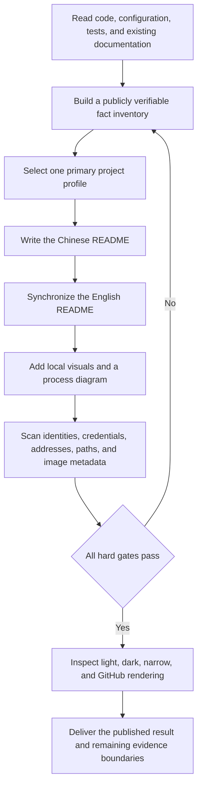

<div align="center">


<h1>GitHub README Standardizer</h1>

<p><strong>Build evidence-backed, actionable, and auditable bilingual repository landing pages</strong></p>

<p>Project maintainers · Documentation owners · Security reviewers</p>

<p>
  
  <a href="README.md"></a>
  <a href="SECURITY.md"></a>
  
</p>

<p>
  <a href="#1-project-value">Project value</a> ·
  <a href="#3-standardization-flow">Standardization flow</a> ·
  <a href="#4-quick-start">Quick start</a> ·
  <a href="#5-project-routing">Project routing</a> ·
  <a href="#7-privacy-and-publication-boundaries">Privacy gate</a> ·
  <a href="#8-validation-status">Validation</a>
</p>

<p><a href="README.md">简体中文</a> · <a href="README.en.md">English</a></p>

</div>

<div align="center">


Figure 1.1. Evidence-backed publication flow

</div>

All numerical values in this document come from repository files, auditor output, or the 2026-08-25 validation record. HTML and SVG dimensions come from the layout attributes in their respective files

## 1 Project value

GitHub README Standardizer is a Codex skill for repository landing pages. A skill is a reusable set of execution rules and supporting resources that applies the same evidence, privacy, and quality gates across different tasks

The skill reads code, configuration, tests, documentation, and trustworthy visual assets before producing a Chinese-first README with an English mirror. Deterministic scans and the rendered GitHub result then determine whether publication is safe

<div align="center">

Table 1.1. Entry points

<table>
  <tr>
    <td width="33%" valign="top"><strong>Audit an existing README</strong><br><br>Locate evidence gaps, broken links, missing visuals, and privacy risks</td>
    <td width="33%" valign="top"><strong>Build a bilingual landing page</strong><br><br>Select a structure from the primary deliverable and synchronize commands, status, and limitations</td>
    <td width="33%" valign="top"><strong>Validate publication</strong><br><br>Scan text and assets, inspect the rendered GitHub page, and decide whether to publish</td>
  </tr>
</table>

</div>

## 2 Core capabilities

<div align="center">

Table 2.1. Core capabilities and observable results

| Capability | Observable result | Evidence |
|---|---|---|
| Project-profile routing | Applications, APIs, command-line tools, infrastructure, AI/data, and technical content receive different landing-page structures | [`references/profile-routing.md`](references/profile-routing.md) |
| Bilingual fact synchronization | `README.md` uses Simplified Chinese while `README.en.md` mirrors commands, status, diagrams, and limitations | [`references/content-protocol.md`](references/content-protocol.md) |
| Visual communication | The hero, badges, images, tables, and Mermaid diagrams support identification, understanding, or validation | [`references/visual-system.md`](references/visual-system.md) |
| Privacy gate | Real identities, credentials, internal addresses, local paths, and unsanitized images block publication | [`references/security-evidence.md`](references/security-evidence.md) |
| Deterministic audit | The auditor checks bilingual files, links, images, headings, sensitive patterns, and asset metadata | [`scripts/audit_readme.py`](scripts/audit_readme.py) |
| Rendered validation | The GitHub page must preserve images, tables, links, details blocks, and Mermaid markup | [`references/validation.md`](references/validation.md) |

</div>

## 3 Standardization flow

The following flow shows how repository evidence enters the README and how the privacy gate blocks an untrustworthy publication

<div align="center">



Figure 3.1. Execution path from repository evidence to a trustworthy README

</div>

## 4 Quick start

Prerequisites: a configured Codex skill directory and Python 3.10 or later. The Python requirement comes from the union type syntax used by the audit program

- Step 1, install the skill from the checked-out repository root:

  ```powershell
  $SkillSource = (Get-Location).Path # Read the reviewed skill files from the current repository root
  $SkillTarget = Join-Path $env:CODEX_HOME "skills/github-readme-standardizer" # Build the destination under the configured Codex directory
  New-Item -ItemType Directory -Path $SkillTarget -Force | Out-Null # Ensure the destination exists before copying files
  Copy-Item -Path (Join-Path $SkillSource "*") -Destination $SkillTarget -Recurse -Force # Copy instructions, references, templates, and the auditor
  ```

- Step 2, run a full audit against a target repository:

  ```powershell
  python scripts/audit_readme.py "<repository-path>" --scan-repository # Replace the semantic placeholder and scan README files, source, fixtures, and visuals
  ```

- Step 3, inspect the JSON result:

  Items in `errors` block publication. Items in `warnings` require human review. The auditor never modifies the target repository

Expected result: the auditor returns `PASS` or `FAIL` with specific issue codes, and it does not echo complete secret values that it detects

## 5 Project routing

The skill selects one primary profile from the main deliverable. Mixed repositories can add a small number of conditional modules without combining several complete templates into one landing page

<div align="center">

Table 5.1. Primary project profiles

| Profile | Primary deliverable | First visual evidence | First success |
|---|---|---|---|
| User application | Web, desktop, or mobile application | Sanitized interface screenshot | Complete one safe user flow |
| Developer interface | Library, SDK, or API component | Minimal call and output | Complete one observable call |
| Command-line tool | Terminal tool or local automation | Synthetic terminal demonstration | Run one safe command |
| Infrastructure service | Long-running service or control plane | Architecture and trust boundary | Start an isolated service and check health |
| AI and data | Model, dataset, training, or evaluation project | Task scope or evaluation relationship | Run a minimal example with synthetic input |
| Technical content | Book, course, knowledge base, or specification | Content map | Open the reading entry point or build a preview |

</div>

## 6 Repository structure

<div align="center">

Table 6.1. Skill file responsibilities

| Path | Content | When to read or run it |
|---|---|---|
| `SKILL.md` | Goals, authorization boundaries, primary flow, and hard gates | Every skill invocation |
| `agents/openai.yaml` | Codex display name, icon, and default prompt | Skill discovery or invocation |
| `assets/` | Bilingual templates and the skill icon | README creation or skill display |
| `references/` | Routing, content, visual, security, research, and validation details | When the current task meets the corresponding condition |
| `scripts/audit_readme.py` | Read-only README and privacy auditor | Before delivery |
| `scripts/test_audit_readme.py` | Positive and negative tests for the auditor | After audit-logic changes |

</div>

## 7 Privacy and publication boundaries

The publication copy contains no personal name, personal email, real user identifier, password, access token, API key, local absolute path, private network address, or live deployment endpoint

The test suite must exercise secret detection. Credential shapes and private addresses are therefore assembled at runtime from separate non-sensitive fragments, so complete fixture values do not enter Git history as source literals

<div align="center">

Table 7.1. Publication blockers

| Target | Safe substitute | Failure consequence |
|---|---|---|
| Accounts and user identifiers | Clearly synthetic values such as `synthetic-user` | Stop publication and regenerate the content |
| Passwords, tokens, and keys | Environment-variable names or unusable placeholders | Stop publication and rotate any potentially exposed credential |
| Internal domains and deployment endpoints | Reserved `example.com` or `.invalid` names | Stop publication and replace every endpoint |
| Local and production paths | Semantic placeholders such as `<repository-path>` | Stop publication and inspect related logs and images |
| Screenshot pixels and image metadata | Synthetic screens or regenerated local vector assets | Stop publication and repeat the visual review |

</div>

The complete reporting process is in [`SECURITY.md`](SECURITY.md). Public issues must never contain secret values

## 8 Validation status

The results below come from local checks of this publication copy on 2026-08-25. The date identifies this validation run, and every later modification requires the full gate sequence again

<div align="center">

Table 8.1. Current validation scope

| Target | Method | Current result | Evidence boundary |
|---|---|---|---|
| Skill structure and metadata | Skill Creator `quick_validate.py` | Passed | Naming, frontmatter, and unfinished scaffold placeholders |
| Auditor behavior | `python scripts/test_audit_readme.py` | 11 tests passed | Bilingual files, links, images, and sensitive patterns |
| Repository content | `audit_readme.py --scan-repository` | Passed with 0 errors and 0 warnings | 2 README files and 22 text files |
| Chinese readability | `Test-HumanReadableChinese.ps1` | Passed with 0 hard errors and 10 terminology reminders | Numbering, prohibited constructions, terminology, and code comments |
| GitHub rendering | Remote README HTML and asset comparison | Passed | GitHub HTML preserves every table, image, link, and Mermaid marker |

</div>

## 9 Limitations

- Automated checks cannot decide whether a marketing claim is reasonable, so maintainers must still review code, tests, and release records
- Automated checks cannot confirm every word in a screenshot from file structure alone, so formal publication still requires visual inspection
- The skill does not grant itself permission to commit, push, publish, or change repository settings; remote writes require explicit user authorization
- This private distribution does not include an open-source license, and repository access does not grant redistribution rights

## 10 Contributing

- Submit reproducible defects through [`CONTRIBUTING.md`](CONTRIBUTING.md) and build minimal cases with synthetic data
- Report security issues through a private channel described in [`SECURITY.md`](SECURITY.md)
- Review template research and adoption boundaries in [`references/research-basis.md`](references/research-basis.md)
- After changing the skill, synchronize both README files and repeat tests, privacy scanning, and rendered GitHub validation
