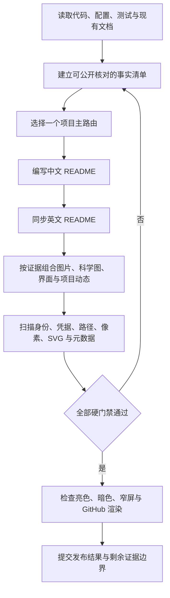

<div align="center">


<h1>GitHub README Standardizer</h1>

<p><strong>把仓库首页构建成有证据、可执行、可审计的中英双语项目入口</strong></p>

<p>项目维护者 · 文档负责人 · 安全审核者</p>

<p>
  
  <a href="README.en.md"></a>
  <a href="SECURITY.md"></a>
  
</p>

<p>
  <a href="#1-项目价值">项目价值</a> ·
  <a href="#3-标准化流程">标准化流程</a> ·
  <a href="#4-快速开始">快速开始</a> ·
  <a href="#5-项目路由">项目路由</a> ·
  <a href="#7-隐私门禁">隐私门禁</a> ·
  <a href="#8-验证状态">验证状态</a>
</p>

<p><a href="README.md">简体中文</a> · <a href="README.en.md">English</a></p>

</div>

<div align="center">


图 1.1　GitHub README Standardizer 的证据驱动发布流程

</div>

本文全部数值来自当前仓库文件和本次审核程序输出，HTML 与 SVG 尺寸值取自各文件的版式属性

## 1 项目价值

GitHub 是托管代码和项目协作记录的平台，README 是访问仓库时首先展示的项目说明

GitHub README Standardizer 是面向 Codex 的仓库首页标准化 Skill

Codex 是能够在授权工作区中读取、修改和验证文件的编码智能体，Skill 是一组可复用执行规则和配套资源

这组规则让不同任务能够采用同一套事实、隐私和质量门禁

这个 Skill 先读取代码、配置、测试、文档和真实视觉资产，再生成中文优先、英文同步的 README，最终使用确定性扫描和 GitHub 渲染结果判断是否可以发布

<div align="center">

表 1.1　使用入口

<table>
  <tr>
    <td width="33%" valign="top"><strong>审核现有 README</strong><br><br>找出事实缺口、失效链接、视觉不足和隐私风险</td>
    <td width="33%" valign="top"><strong>构建双语首页</strong><br><br>按照项目交付物选择结构，并同步命令、状态和限制</td>
    <td width="33%" valign="top"><strong>执行发布验收</strong><br><br>扫描文本与资源，检查 GitHub 实际渲染，再决定是否发布</td>
  </tr>
</table>

</div>

## 2 核心能力

<div align="center">

表 2.1　核心能力与可观察结果

| 能力 | 可观察结果 | 证据位置 |
|---|---|---|
| 项目类型路由 | 应用、接口、命令行、基础设施、人工智能数据和技术内容采用不同首页结构 | [`references/profile-routing.md`](references/profile-routing.md) |
| 双语事实同步 | `README.md` 使用简体中文，`README.en.md` 同步命令、状态、图表和限制 | [`references/content-protocol.md`](references/content-protocol.md) |
| 模块化组合 | 核心模块保持完整，界面、科学图、动态指标等条件模块按证据启用 | [`references/module-catalog.md`](references/module-catalog.md) |
| 图片生产 | 区分运行证据、解释图和品牌视觉，规定生成输入、格式、主题和后备内容 | [`references/visual-production.md`](references/visual-production.md) |
| 科学制图 | 约束图形选择、轴、单位、样本、不确定性、数据来源和复现入口 | [`references/scientific-visualization.md`](references/scientific-visualization.md) |
| UI 与 UX 证据 | 使用合成界面覆盖完整任务，并检查亮色、暗色、窄屏与失败状态 | [`references/ui-ux-evidence.md`](references/ui-ux-evidence.md) |
| 徽章与项目动态 | 可信状态保留在首屏，星标、下载和趋势只在页面末尾补充 | [`references/metrics-and-badges.md`](references/metrics-and-badges.md) |
| 视觉隐私 | 同时检查像素、SVG 源码、文件元数据和远程视觉请求 | [`references/visual-privacy.md`](references/visual-privacy.md) |
| 确定性审核 | 审核程序检查双语、链接、秘密、用户路径、编号、Mermaid 方向、SVG 安全和图片元数据 | [`scripts/audit_readme.py`](scripts/audit_readme.py) |
| 渲染验收 | GitHub 页面需要正确保留图片、表格、链接、详情块和 Mermaid 标记 | [`references/validation.md`](references/validation.md) |

</div>

## 3 标准化流程

以下流程图说明证据怎样进入 README，以及安全门禁为什么能够阻止不可信发布

<div align="center">



图 3.1　从仓库证据到可信 README 的执行关系

</div>

## 4 快速开始

前置条件：本机已经配置 Codex Skill 目录，并安装 Python 3.10 或更高版本，Python 版本要求来自审核程序使用的联合类型语法

- 第一步，在已经检出的仓库根目录安装 Skill：

  ```powershell
  $SkillSource = (Get-Location).Path # 从当前仓库根目录读取经过审核的 Skill 文件
  $SkillTarget = Join-Path $env:CODEX_HOME "skills/github-readme-standardizer" # 在已配置的 Codex 目录下建立目标位置
  New-Item -ItemType Directory -Path $SkillTarget -Force | Out-Null # 确保目标目录存在，避免复制因目录缺失而失败
  Copy-Item -Path (Join-Path $SkillSource "*") -Destination $SkillTarget -Recurse -Force # 复制 Skill 指令、参考资料、模板和审核程序
  ```

- 第二步，对目标仓库运行完整审核：

  ```powershell
  python scripts/audit_readme.py "<repository-path>" --scan-repository --strict-warnings # 使用仓库路径占位值扫描 README、源码、测试夹具和视觉资源，未确认提醒阻止正式发布
  ```

- 第三步，读取审核程序返回的 JSON 数据交换格式（JavaScript Object Notation）结果：

  `errors` 中的项目会阻止发布，`warnings` 中的项目需要人工确认；正式发布使用 `--strict-warnings`，程序不会自动修改目标仓库

预期结果：审核程序返回 `PASS` 或带有明确问题代码的 `FAIL`，输出不会回显已经识别的完整秘密值

## 5 项目路由

Skill 按主要交付物选择一个主路由，混合项目可以增加少量条件模块，避免把多个完整模板机械拼接到同一首页

<div align="center">

表 5.1　项目主路由

| 主路由 | 主要交付物 | 第一视觉证据 | 第一次成功 |
|---|---|---|---|
| 用户应用 | 网页、桌面或移动应用 | 脱敏界面截图 | 完成一个安全用户流程 |
| 开发接口 | 开发库、软件开发工具包或接口组件 | 最小调用与输出 | 完成一次可观察调用 |
| 命令行工具 | 终端工具或本地自动化程序 | 合成终端演示 | 执行一条安全命令 |
| 基础设施服务 | 持续运行的服务或控制平面 | 架构与信任边界 | 启动隔离服务并检查健康状态 |
| 人工智能数据 | 模型、数据集、训练或评测项目 | 任务范围或评测关系 | 使用合成输入完成最小运行 |
| 技术内容 | 书籍、课程、知识库或规范 | 内容地图 | 打开阅读入口或构建预览 |

</div>

## 6 仓库结构

<div align="center">

表 6.1　Skill 文件职责

| 路径 | 内容 | 何时读取或执行 |
|---|---|---|
| `SKILL.md` | 目标、授权边界、主流程和硬门禁 | 每次调用 Skill 时 |
| `agents/openai.yaml` | Codex 界面名称、图标和默认提示 | Skill 被发现或调用时 |
| `assets/README.*.template.md` | 中文优先和英文镜像的完整骨架 | 新建或重构 README 时 |
| `assets/visual-modules.*.md` | 图片、科学图、界面、稳定性、脱敏和项目动态的双语片段 | 启用条件视觉模块时 |
| `references/module-catalog.md` | 模块顺序、启用依据和删除规则 | 组合 README 结构时 |
| `references/visual-*.md` | 图片生产与视觉隐私细则 | 存在任何视觉资产时 |
| `references/scientific-visualization.md` | 科学图和性能图的语义与复现要求 | 使用实验、评测或基准数据时 |
| `references/ui-ux-evidence.md` | 界面证据和页面稳定性矩阵 | 项目具有用户界面时 |
| `references/metrics-and-badges.md` | 徽章、星标、活动与趋势的选择门禁 | 展示动态状态或社区指标时 |
| `scripts/audit_readme.py` | 只读 README、SVG、图片元数据与隐私审核程序 | 交付前 |
| `scripts/test_audit_readme.py` | 审核程序的正向与反向测试 | 修改审核逻辑后 |

</div>

## 7 隐私门禁

仓库发布副本不得保存个人名称、个人邮箱、真实用户标识、密码、访问令牌、应用程序接口密钥、本机绝对路径、私有网络地址或实际部署地址

测试程序需要验证秘密检测能力，因此测试程序会在运行时合成凭据形状和私网地址

完整测试值由多个无敏感含义的片段组成，不会作为源代码字面量进入 Git 版本控制历史

<div align="center">

表 7.1　发布阻断范围

| 检查对象 | 安全替代值 | 失败后果 |
|---|---|---|
| 账号与用户标识 | `synthetic-user` 等明确合成值 | 停止发布并重新生成内容 |
| 密码、令牌和密钥 | 环境变量名或不可用占位值 | 停止发布并轮换可能暴露的凭据 |
| 内部域名与部署地址 | `example.com` 或 `.invalid` 保留域名 | 停止发布并替换全部入口 |
| 本机路径与生产目录 | `<repository-path>` 等语义占位值 | 停止发布并检查关联日志与图片 |
| 截图和图片元数据 | 合成画面或重新生成的本地矢量图 | 停止发布并重新执行像素审核 |
| SVG 源码 | 静态路径、形状、文字和仓库内片段引用 | 脚本、事件处理器、外部引用或实体声明会阻止发布 |
| 远程徽章与统计 | 本地静态状态或仓库原生文字入口 | 无法解释请求、日志、缓存或失效行为时停止接入 |

</div>

完整报告流程位于 [`SECURITY.md`](SECURITY.md)，视觉审核细则位于 [`references/visual-privacy.md`](references/visual-privacy.md)，公开问题跟踪不接收秘密值

## 8 验证状态

以下结果来自 2026-08-26 对当前候选版本执行的检查，后续修改需要重新运行全部门禁

<div align="center">

表 8.1　当前验证范围

| 检查对象 | 验证方法 | 当前结果 | 证据边界 |
|---|---|---|---|
| Skill 结构与元数据 | Skill Creator `quick_validate.py` | 通过 | 检查命名、前置元数据和脚手架占位 |
| 审核程序行为 | `python scripts/test_audit_readme.py` | 18 项测试通过 | 覆盖双语、链接、秘密、用户路径、编号、Mermaid、SVG 和图片元数据 |
| 仓库内容 | `audit_readme.py --scan-repository` | 通过，0 个错误和 0 个提醒 | 2 份 README、30 个文本文件、6 个 SVG 和 0 个位图 |
| 中文可读性 | `Test-HumanReadableChinese.ps1` | 通过，0 个硬错误和 10 个术语提醒 | 检查编号、禁用句式、术语和代码注释 |
| GitHub 渲染 | GitHub Markdown HTML 与 Playwright 浏览器核对 | 通过 | 7 个表格、6 张本地图、11 个主章节和 1 个 Mermaid；亮色、暗色和窄屏均无页面溢出 |

</div>

## 9 限制

- 自动审核无法判断营销声明是否合理，维护者仍需核对代码、测试和发布记录
- 自动审核无法仅凭文件内容确认截图中所有文字或科学结论是否成立，正式发布仍需像素检查和领域复核
- Skill 不会自动获得提交、推送、发布或修改仓库设置的权限，远端写入需要用户明确授权
- 仓库公开可见，但当前没有附带开源许可证；公开访问不等同于获得复制、修改或再分发授权

## 10 贡献指南

- 可复现缺陷按照 [`CONTRIBUTING.md`](CONTRIBUTING.md) 提交，并使用合成数据构造最小案例
- 安全问题按照 [`SECURITY.md`](SECURITY.md) 使用私密渠道报告
- 模板研究和采用边界记录在 [`references/research-basis.md`](references/research-basis.md)
- Skill 修改后需要同步中文与英文 README，并重新运行测试、隐私扫描和 GitHub 渲染验收

## 11 项目动态

项目动态位于页面末尾，只补充维护状态，不能代替功能、性能、质量或安全证据

<div align="center">

表 11.1　当前项目动态

| 指标 | 当前状态 | 证据来源 | 外部服务 |
|---|---|---|---|
| 发布方式 | 默认分支持续更新 | 当前 Git 提交与验证记录 | 不需要 |
| 自动审核 | 18 项行为测试 | [`scripts/test_audit_readme.py`](scripts/test_audit_readme.py) | 不需要 |
| 星标与访问趋势 | 未启用 | 当前版本不向第三方统计图片服务发送访问数据 | 无 |

</div>
